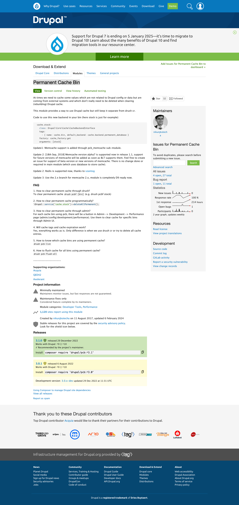

autoscale: false
build-lists: false
slidenumbers: true
text-strong: #9EA6D7
list: bullet-character(-)
presenter-notes: text-scale(0.6)
footer: **Pete Inge** | Bluecadet | _Synchronizing Art with Technology_

# Synchronizing Art with Technology
## Data Integration at the Amon Carter Museum of American Art

^
* Be the Storyteller
* Breath....

---

# Who am I?

## Pete Inge
### Senior Systems Architect, Bluecadet

**pinge@bluecadet.com**
**github.com/pingevt**
**peteinge.com**


^ Experience: ~10yrs freelance in web dev
Worked in D5-D10
Current: @ BC for >8 years
I'm a problem solver
Contact for more info

___

[.background-color: #FFFFFF]
[.slide-transition: push(horizontal, 0.3)]
[.footer: ]
[.slidenumbers: false]


---

[.slide-transition: push(horizontal, 0.3)]
[.text-strong: #ffffff]

# What is Amon Carter

**Located in the heart of Fort Worth’s Cultural District, the Amon Carter Museum of American Art (the Carter) is a dynamic cultural resource that provides unique access and insight into the history and future of American creativity through its expansive exhibitions and programming. Admission is always free. To learn more about the Carter, visit cartermuseum.org.**


^
I'll let you read that, but the Carter is a great medium size museum in Texas.

^
We at Bluecadet, partnered with them a few years ago to work on their website.

^
--> I want to find out about you... -->

---

[.build-lists: true]
# Quick Poll

* Interest in Art and Technology Integration
* You have current challenges in mind
* You have a future project in mind
* Other

^ 2 mins
Audience? Why did they attend the talk?

^
--> Let's define a few things -->

---

# What is **Data Syncing**?


^
What is Data syncing? (2 mins)

^ Sorry about the AI imagery, but talks on data are hard to get great images.

---

[.slide-transition: fade(0.0)]

# What is **Data Syncing**?

## Bringing external data into your site for a specific purpose


^
What is Data syncing? (2 mins)

^
Bringing external data into your site for a specific purpose

^
Maintains current Source of truth

^
Maintaining 2 independent sources

^
Mostly maintains data structure

---

[.slide-transition: fade(0.0)]

# What is **Data Syncing**?

## Bringing external data into your site for a specific purpose

### It is **NOT** migration


^
What is Data syncing? (2 mins)

^
It is NOT migration (explain the difference)
Migration is changing the source of truth
Moving old source to new source, often modifying the data structure

^
- Picky distinction, but I think important **detail** to keep in mind

---

[.build-lists: true]

# Why are we talking about this today?

* We're developers at a conference.. duh
* Current state of technology
* We have seen a surge in organizations wanting to digitize

^
Why are we talking about this? (2 mins)
- Microservices and data everywhere
- Modernizing collections (data)
- W/ the pandemic, surge in orgs wanting to digitize
- Drupal is a great platform for larger enterprise level syncs

---

[.slide-transition: fade(0.0)]
[.slidenumbers: false]
[.footer: ]

# Why are we talking about this today?

* In the museum space, a typical museum has about 95% of their collection in storage


^
Why are we talking about this? (2 mins)
- Typical museum has about 95% of their collection in storage
- Getting the public to see your content, not just researchers
- effects researchers, etc

^
However many more reasons for Syncing Data.

^
--> Let's look at the carter.

---

# the __Amon Carter__

[.text: text-scale(1.4)]

> Create an easy-to-use and accessible collections explorer. The collections explorer will highlight the Carter’s dynamic collection and act as a digital extension of the in-gallery experience.

^ less technical client so we had broad strokes vs hard rules

^
--> heres a preview of the end result

---

[.slidenumbers: false]
[.footer: ]


^
We synced in Artworks, Archive object (pdfs, letters, etc), Artists, Exhibition data.

---

# the __Amon Carter__

<br>


---

# the __Amon Carter__

[.slide-transition: fade(0.0)]

* Artworks


---

[.slide-transition: fade(0.0)]

# the __Amon Carter__

* Artworks,
* Archive object (pdfs, letters, etc)


---

[.slide-transition: fade(0.0)]

# the __Amon Carter__

* Artworks,
* Archive object (pdfs, letters, etc)
* Artists


---

[.slide-transition: fade(0.0)]

# the __Amon Carter__

* Artworks,
* Archive object (pdfs, letters, etc),
* Artists
* Exhibition Data


---

[.slidenumbers: false]
[.footer: ]


^
Lets dive in!

^
at a high level, I break syncing into 3 parts.

---

[.text: alignment(center)]
[.footer-style: alignment(left)]
[.slidenumber-style: alignment(right)]

# <br>
# <br>
# <br>
# First, _define_ the **state**
# and the **constraints**

^
As developers, hopefully this is a bit obvious. We need to define the problem.

^ <br>I would say here, you should probably document this. As you'll hear me say in future slides, I don't remember the WHY

^
Years later are my issues based on a whim or a real reason?

---

[.text: alignment(center)]
[.footer-style: alignment(left)]
[.slidenumber-style: alignment(right)]

# <br>
# <br>
# <br>
# Second, _decide_ on an
# execution **strategy**

^
How does this work, what is the methodology.

^
Think through the consequences

---

[.text: alignment(center)]
[.footer-style: alignment(left)]
[.slidenumber-style: alignment(right)]

# <br>
# <br>
# <br>
# Third, _decide_ on
# the right **tools**

^
Make sure you are using the right tools.

^
tech debt, save yourself as much as you can in the future.

---

# Say it again

1. First, _define_ the **state** and the **constraints**
1. Second, _decide_ on an execution **strategy**
1. Third, _decide_ on the right **tools**

^
--> Lets look at how we did walked through these steps for Amon Carter. -->

---

[.build-lists: true]

# First, _define_ the **state** and the **constraints**
## Starting Development

* The Carter's IT team had set up a pipeline for their Collection Data to sync to their DAMs
* Custom Data Structures, in JSON format
* Low volume of updates
* Did not need immediate updates
* Wanted all the imagery **in** the CMS

^
We are lucky with most museums that we don't need instantaneous/real-time updates.
We were told low volume of updates

^
I forget why, but all imagery in the CMS. (was it a whim?)

^
We created more constraints as we worked through the process.

^
Important to _understand_ the data

---

---

# Second, _decide_ on an execution **strategy**
## Syncing Strategies

[.column]

<br>

[.column]

<br>

---

[.slide-transition: fade(0.0)]

# Second, _decide_ on an execution **strategy**
## Syncing Strategies

[.column]

1. Use live external endpoints

^ I would say not recommended, but there are some use cases.
THF is a good example of the use case. [todo pics!]
Connection to Github (to display open tickets) [todo pics!]
NOT an option for AC


[.column]

---

[.slide-transition: fade(0.0)]

# Second, _decide_ on an execution **strategy**
## Syncing Strategies

[.column]

1. Use live external endpoints

[.column]


^ I would say not recommended, but there are some use cases.
THF is a good example of the use case. [todo pics!]
Connection to Github (to display open tickets) [todo pics!]
NOT an option for AC

---

[.slide-transition: fade(0.0)]

# Second, _decide_ on an execution **strategy**
## Syncing Strategies

[.column]

1. Use live external endpoints
1. Save raw data, process on the fly

[.column]


^
Where do you want the lift to be?
**Will the end user be affected by this?**
Ex: Wikidata bio fields
“Fallback content” - could process on the fly
 * Process thousands of pieces of data with an unknown amount actually needed.
 * Assuming “Important” content will not need fallbacks

---

[.slide-transition: fade(0.0)]

# Second, _decide_ on an execution **strategy**
## Syncing Strategies[^1]

[.column]

1. Use live external endpoints
1. Save raw data, process on the fly
1. Bring all data into Drupal Entities, _nodes and taxonomies etc._

[.column]


[^1]: A few more we’ll talk about later, but these were the options I had in my mind at the time for AC.

^
**Most robust**
How much do we need to “Drupalize” all the data?
Do I need to use the data in the CMS?
I may need taxonomies for other parts of the site to build views or determine “related” content.

^ Current client want to associate foreign ids in the editorial work, rather then let Drupal be Drupal.

^
--> What did we choose for the Carter? -->

---

[.slide-transition: fade(0.0)]

# Second, _decide_ on an execution **strategy**
## Syncing Strategies - Solution

[.text-strong: #9EA6D7]

[.column]

1. Use live external endpoints
1. Save raw data, process on the fly
1. **Bring all data into Drupal Entities, _nodes and taxonomies etc._**

[.column]


^

---

[.slide-transition: fade(0.0)]

# Second, _decide_ on an execution **strategy**
## Syncing Strategies - Solution

### We wanted to “Drupalize” all the data
  * Needed related data, the data was not in a silo

^
We're relating artworks and artists in content throughout the site for the authoring experience.

---

[.slide-transition: fade(0.0)]

# Second, _decide_ on an execution **strategy**
## Syncing Strategies - Solution

### We wanted to “Drupalize” all the data
  * Needed related data, the data was not in a silo
  * Content was going to be _enhanced_ in the CMS

^
Needed a ref for content authors.

^
Collection data is curatorially heavy... need to enhance for the general public.

^
Educational Materials

---

[.slide-transition: fade(0.0)]

# Second, _decide_ on an execution **strategy**
## Syncing Strategies - Solution

### We wanted to “Drupalize” all the data
  * Needed related data, the data was not in a silo
  * Content was going to be _enhanced_ in the CMS
  * Content was going to be indexed through the Search API[^2]

[^2]: honestly not needed, but I didn’t fully understand that at the time

^
At this point, I had used search_api in the past, but ...I was a "configurer" but didn't understand the nuts and bolts.

^
Goes back to documentation. Unfortunately I don't remember the exact why's on these decisions.

---

^
-->

---

# Third, _decide_ on the right **tools**
## What tools exist?

[.column]

<br>

[.column]


^ Migrate module
Migrate can be used for syncing
History of migrate: D->D

^ explain drupal is everything for everybody.

---

[.slide-transition: fade(0.0)]

# Third, _decide_ on the right **tools**
## What tools exist?

[.column]

1. Migrate Module

[.column]


^ Migrate module
Migrate can be used for syncing
History of migrate: D->D

^ explain drupal is everything for everybody.

---

[.slide-transition: fade(0.0)]

# Third, _decide_ on the right **tools**
## What tools exist?

[.column]

1. Migrate Module
1. Feeds Module

[.column]


^ Feeds __module__
History of feeds: Ingesting RSS, XML feeds

---

[.slide-transition: fade(0.0)]

# Third, _decide_ on the right **tools**
## What tools exist?

[.column]

1. Migrate Module
1. Feeds Module
1. Custom Code

[.column]


^
Custom Code
1. Extra effort
1. Technical debt
2. tech debt on contributors / opensource comm instead of on your devs

---

[.slide-transition: fade(0.0)]

# Third, _decide_ on the right **tools**
## What tools exist?

[.column]

1. Migrate Module
1. Feeds Module
1. Custom Code
1. External to CMS

[.column]


^
Not sure what conditions I would suggest this.
You really have to know what you're doing
Let Drupal, **Drupal**
(especially writing directly to the DB, or at least to drupal’s tables)

^
write to filesystem, process later. if we have 100K objects do we need them all in Drupal?

^
Example: Exhibitions

---

[.slide-transition: fade(0.0)]

# Third, _decide_ on the right **tools**
## What tools exist?

[.column]

1. Migrate Module
1. Feeds Module
1. **Custom Code**
1. External to CMS

[.column]


^
I like to reinvent the wheel, b/c i obviously can do it better...

^
--> So lets look at some more technical reasons. -->

---

# Third, _decide_ on the right **tools**
## What tools exist?

### Timing and queueing the updates required a custom code solution


<br>

---

[.build-lists: true]

# Third, _decide_ on the right **tools**
## What tools exist?

### Timing and queueing the updates required a custom code solution

[.column]

1. Grab Data
2. Add item to a Queue Worker(s)
3. Process Item in the queue at a later time (cron)

[.column]

```php

  ...
  $queue_factory = \Drupal::service('queue');
  $queue = $queue_factory->get($queue_id);

  $queue_manager = \Drupal::service('plugin.manager.queue_worker');
  $queue_worker = $queue_manager->createInstance($queue_id);

  $start = time();

  // Run for 25 seconds or 10000 items.
  $count = 1;
  while ((time() - $start) < 25 && $count <= $total) {
    $item = $queue->claimItem(43200);

  }
  ...

```

---

# Third, _decide_ on the right **tools**
## What tools exist?

### Custom Code

Actual ingestion of data could have been Feeds or Migration, but would have required some custom tampering, or migration processes[^3]


[^3]: I always go back and forth, b/c I want to do it the “Drupal way” but reality is you will still need custom code.

^
--> Quick recap -->

---

# Say it again

1. First, _define_ the **state** and the **constraints**
   * Create a dynamic collections explorer to highlight the Carter’s collection.
2. Second, _decide_ on an execution **strategy**
   * Bring all data into Drupal Entities, _nodes and taxonomies etc._
3. Third, _decide_ on the right **tools**
   * Custom Code

^
let's recap!

^
--> On to things we learned -->
--> So what did we learn from all this? -->

---

[.footer: ]
[.slidenumbers: false]


---

[.text: text-scale(0.95)]

# Things We Learned

[.column]

<br>

[.column]

<br>

^
What worked and what did not.  (5 mins)

---

[.text: text-scale(0.95)]

# Things We Learned

[.column]

* Dealing with Image files
  * Text is fast, images (files) are not
  * How to detect new images

[.column]

<br>

^
What worked and what did not.  (5 mins)

^
Dealing with images - should spend a lot more time thinking about this.

---

[.text: text-scale(0.95)]

# Things We Learned

[.column]

* Dealing with Image files
  * Text is fast, images (files) are not
  * How to detect new images
* Custom Code
  * Error catching and handling
  * Proper reporting for what fails

[.column]

<br>

^
What worked and what did not.  (5 mins)

^
B/c of custom code, we needed to add in more error checking and handling after the fact. We weren’t handling failure well or able to debug why failures were happening.

---

[.text: text-scale(0.95)]

# Things We Learned

[.column]

* Dealing with Image files
  * Text is fast, images (files) are not
  * How to detect new images
* Custom Code
  * Error catching and handling
  * Proper reporting for what fails

[.column]

* Reliability of the external data source
  * Availability and speed

^
What worked and what did not.  (5 mins)

^
Slow external API.

---

[.text: text-scale(0.95)]

# Things We Learned

[.column]

* Dealing with Image files
  * Text is fast, images (files) are not
  * How to detect new images
* Custom Code
  * Error catching and handling
  * Proper reporting for what fails

[.column]

* Reliability of the external data source
  * Availability and speed
* Dates

^
What worked and what did not.  (5 mins)

^
Date strings to date objects.

---

[.text: text-scale(0.95)]

# Things We Learned

[.column]

* Dealing with Image files
  * Text is fast, images (files) are not
  * How to detect new images
* Custom Code
  * Error catching and handling
  * Proper reporting for what fails

[.column]

* Reliability of the external data source
  * Availability and speed
* Dates
* Pre-caching

^
What worked and what did not.  (5 mins)

^
During maintenance, second queue to pre-cache teaser views of artwork content

---
# Future Thoughts and Strategies

^
Future Strategies  (5 mins)

---

[.slide-transition: false]

# Future Thoughts and Strategies

* “Synced data Entities” connected to “Enhanced Data Nodes”


^
Future Strategies  (5 mins)

---

[.slide-transition: fade(0.0)]

# Future Thoughts and Strategies

* “Synced data Entities” connected to “Enhanced Data Nodes”


^
Future Strategies  (5 mins)

---

[.slide-transition: fade(0.0)]

# Future Thoughts and Strategies

* “Synced data Entities” connected to “Enhanced Data Nodes”


^
Future Strategies  (5 mins)

---

[.slide-transition: fade(0.0)]

# Future Thoughts and Strategies

* “Synced data Entities” connected to “Enhanced Data Nodes”


^
Future Strategies  (5 mins)

---

[.slide-transition: fade(0.0)]

# Future Thoughts and Strategies

* “Synced data Entities” connected to “Enhanced Data Nodes”


^
Future Strategies  (5 mins)

---

[.slide-transition: fade(0.0)]

# Future Thoughts and Strategies

* “Synced data Entities” connected to “Enhanced Data Nodes”


^
Future Strategies  (5 mins)

---

[.slide-transition: fade(0.0)]

# Future Thoughts and Strategies

* “Synced data Entities” connected to “Enhanced Data Nodes”


^
Future Strategies  (5 mins)

---

[.slide-transition: fade(0.0)]

# Future Thoughts and Strategies

* “Synced data Entities” connected to “Enhanced Data Nodes”


^
Future Strategies  (5 mins)

---

[.slide-transition: fade(0.0)]

# Future Thoughts and Strategies

* “Synced data Entities” connected to “Enhanced Data Nodes”


^
Future Strategies  (5 mins)


---

[.slide-transition: fade(0.0)]

# Future Thoughts and Strategies

* “Synced data Entities” connected to “Enhanced Data Nodes”


^
Future Strategies  (5 mins)

---

[.slide-transition: fade(0.0)]

# Future Thoughts and Strategies

* “Synced data Entities” connected to “Enhanced Data” nodes
* Bringing in majority of data to custom database tables


^
Future Strategies  (5 mins)

^
- Current project, bringing in majority of data to custom database tables
- Speeds up syncing (less entities for complicated data)
- Speeds up development time
- If I need to “Drupalize” specific data, I can in the future.
- Code is a bit more in-line with “Drupal code”
- I could be wrong about this, but I'd like to think it's true.
- I'd love to get timing data on this... hoped to have it for this talk, but...

^
--> Lets look at another -->

---

[.slide-transition: false]

# Future Thoughts and Strategies

* “Synced data Entities” connected to “Enhanced Data” nodes
* Bringing in majority of data to custom database tables
* Caching strategies (in regards to large datasets) [^4]



[^4]: Permanent Cache Bin -> https://www.drupal.org/project/pcb

^
Future Strategies  (5 mins)

^
Current project, bringing in majority of data to custom database tables

^
Permanent Cache - do you really need to clear cache?

---

[.slide-transition: false]

# Future Thoughts and Strategies

* “Synced data Entities” connected to “Enhanced Data” nodes
* Bringing in majority of data to custom database tables
* Caching strategies (in regards to large datasets)
* Re: Search API, writing custom index plugins is really easy (Once you figure it out)


^
Future Strategies  (5 mins)

^
Current project, bringing in majority of data to custom database tables

^
Permanent Cache - do you really need to clear cache?

^
Re Search API, writing custom index plugins is really easy (Once you figure it out)

---

[.header: alignment(left), text-scale(2.0)]
[.footer-style: alignment(left), line-height(8), #rr0000, text-scale(1.5)]
[.footer: ]
[.text: alignment(right)]
[.slidenumbers: false]

[.column]

# Thank you!

## <br>Questions?
## Comments?
## Discussion?
## Feedback?

[.column]

<br><br><br><br><br><br><br><br>


pinge@bluecadet.com
pete.inge@gmail.com
**peteinge.com**
<sub>**github.com/pingevt/drupalcamp\_nj\_2024\_data_sync**</sub>

^
QA (rest)

---
