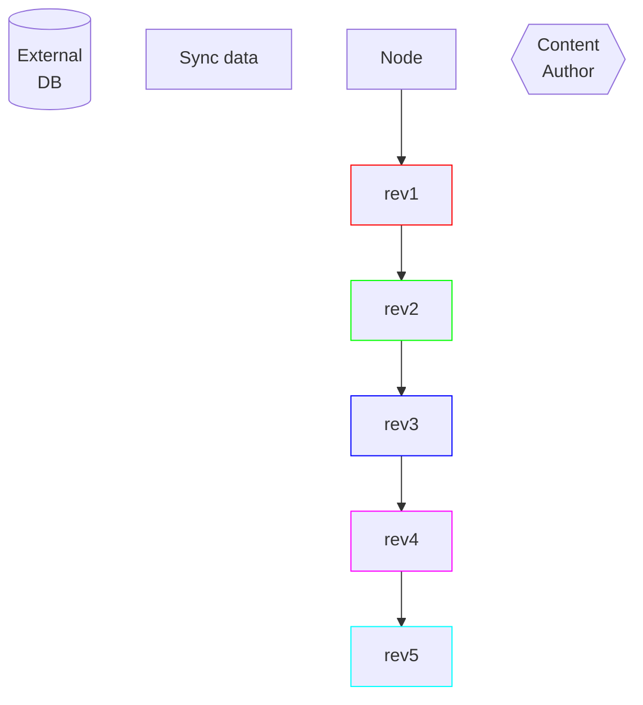

```mermaid

flowchart TB

  eDb[(External<br>DB)]

  data[Sync data]
  node[Node]
  node-->rev1[rev1]
  rev1-->rev2[rev2]
  rev2-->rev3[rev3]
  rev3-->rev4[rev4]
  rev4-->rev5[rev5]

  class data revision1

  ct{{Content<br>Author}}

  style rev1 stroke:#ff0000
  style rev2 stroke:#00ff00
  style rev3 stroke:#0000ff
  style rev4 stroke:#ff00ff
  style rev5 stroke:#00ffff


```
